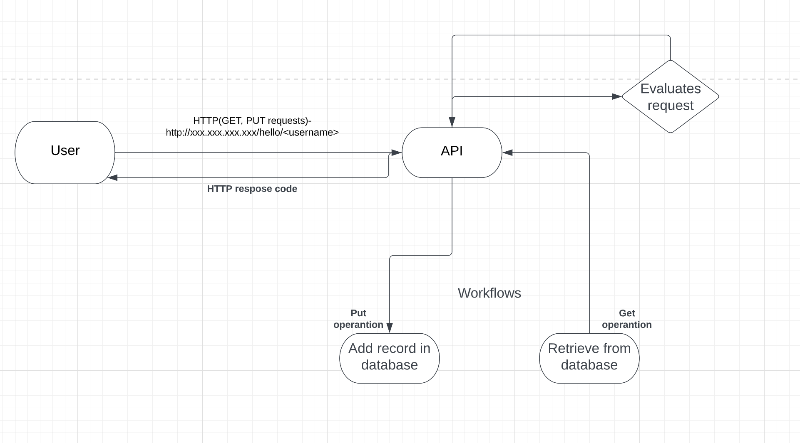

# Birthdayapp

## Problem specification

```
Design and code a simple "Hello World" application that exposes the following HTTP-based APIs: 

Description: Saves/updates the given user's name and date of birth in the database. 
Request: PUT /hello/<username> { "dateOfBirth": "YYYY-MM-DD" }
Response: 204 No Content
 
Note:
<usemame> must contains only letters. 
YYYY-MM-DD must be a date before the today date. 

Description: Returns hello birthday message for the given user 
Request: Get /hello/<username> 
Response: 200 OK 

Response Examples: 
A. If username's birthday is in N days: { "message": "Hello, <username>! Your birthday is in N day(s)" } 
B. If username's birthday is today: { "message": "Hello, <username>! Happy birthday!" } 

Note: Use storage/database of your choice. The code should have at least one unit test. 
```

## Project structure & design


- root directory contain docker-compose, Jenkins Dockerfile, Jenkins Groovy pipeline file, terraform.tf, inputs.tf, main.tf, terraform modules file, keys file, templates file
- modules: contains terraform modules
- modules/vpc: network creation module
- modules/instance: instance creation module
- templates: contains user data to be passed when provisioning an instance
- server: contains HTTP server sources
- server/tests: contains pytest's unit tests
- server/logs: directory with logs
- server/users.sqlite: SQLite database, created dynamically
- server/Dockerfile: Dockerfile of server
- server/tests.Dockerfile: Dockerfile for pytest (see docker-compose.yaml for further information)

## How to run and test locally

- Run server ```python3 main.py``` :
```cd server```
```python3 main.py```
    - First test: ```curl -X PUT http://127.0.0.1:8080/hello/George -H "Content-Type: application/json" -d '{ "dateOfBirth": "2014-10-19" }'```
    - Second test: ```curl -X GET http://127.0.0.1:8080/hello/George``` will retrieve the number of days the user has until for their birthday, these will also be logged in the server runtime and in the logs folder
- Run test without logging ```pytest -q``` 
- Run test without logging ```cd server/tests, pytest -q -c pytest_logs.ini```

- ! There's a workaround to install terraform 0.13.0: https://installvirtual.com/install-specific-version-of-terraform-mac-with-brew/

- Known issues, it may require to install pytest first before running the above commands, fixes ```pip install -U pytest```, it will prompt in red when running ```pytest -q``` to add a Python library to the path, fix: ```export PATH=/Users/Andrei.Pirjol/Library/Python/3.8/bin:$PATH```, lastly it will complain that request library does not exist, fix: ```pip install requests```

Logs can be found in "logs" directory.

## How to run and test via terraform
```bash
Update the inputs.tf file at the defaults with AWS credentials, will be used by the provider to know in which account to provision infrastructure:
variable "access_key" {
  type        = string
  description = "AWS IAM access key"
  default     = ""
}

variable "secret_key" {

  type        = string
  description = "AWS Secret access key"
  default     = ""
}

Generate a SSH key pair that will be used to authenticate on an EC2 instance after provisioning:

e.g. ssh-keygen -b 2048 -t rsa -C "email@address"

Take the 2 keys and place them in the keys directory(first create it in the project root directory: mkdir keys)

Then update in inputs.tf by using the .pub key

variable "public_key" {
  type        = string
  description = "Public key to be used in authorized_keys in order to connect to the instance over SSH"
  default     = "keys/app_id_rsa.pub"
}

terraform init --backend=false (saves a state locally)
terraform validate (It clears out the code of any sintax errors)
terraform plan --out birthdayapp.out
terraform apply birthdayapp.out

approve - type in yes

The apply takes place quickly, the provisioning part will take a few minutes to initialize, after it finishes, SSH into the machine with the private key from the directory keys/id_rsa using: ssh ec2-user@IP -i keys/id_rsa.

Inside the machine the project directory will be in the top level filesystem, cd inside it,
wait a few minutes for the docker containers to spin up then do docker-compose ps to see them.

It includes a Jenkins build that can be used a continuous deployment tool for newer versions of the application using the Jenkinsfile added in the project.
```

## Setting up - Prerequisites

### OSX
```bash
Install Python3

brew update
brew install python
pip3 install -U pytest # for Python 3.7.9
pytest --version # you can check if it's pytest 7.2.0
pip3 install requests
or 
pip3 install -r requirements

Install terraform:
 
brew tap hashicorp/tap
brew install hashicorp/tap/terraform

If you want to upgrade version of terraform, this is optional:

brew upgrade hashicorp/tap/terraform
```
